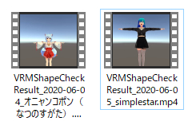

# VRMAllShapeChecker

VRM All BlendShape Checker

## Requirements

Import [UniVRM v0.55.0](https://github.com/vrm-c/UniVRM/releases)
- UniVRM-0.55.0_ce1c.unitypackage
- UniVRM-samples-0.55.0_ce1c.unitypackage  

Import TextMesh Pro.

## Usage

Open SimplestarGame>VRMAllShapeChecker>Scenes
- SampleScene  

Play on Unity Editor (This tool only work on Editor! because Unity Recorder is used.)

Push "Open VRM" button and select check target vrm file.

## Result

You will find the RecResult/VRMShapeCheckResult_2020-06-04_filename.mp4
